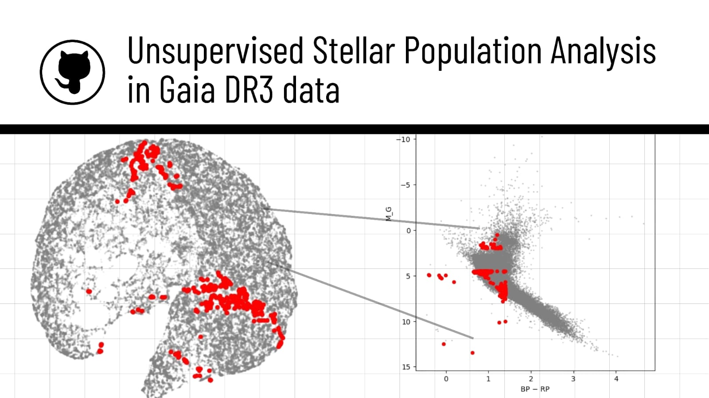
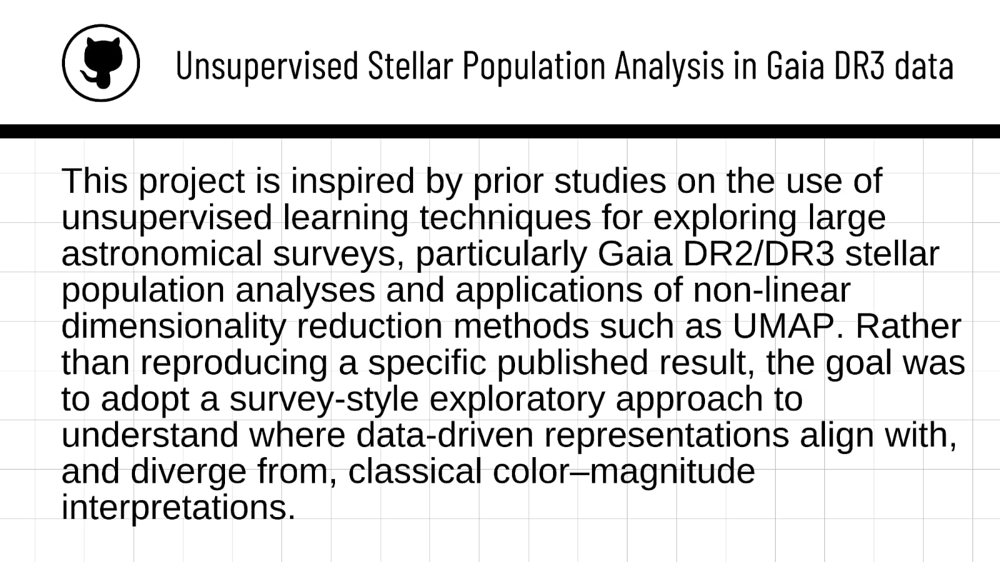

## Unsupervised Exploration of Stellar Population Ambiguities in Gaia DR3

Overview-
Large astronomical surveys such as Gaia DR3 provide unprecedented volumes of high-quality stellar data, but interpreting this data remains challenging due to intrinsic degeneracies in photometric measurements and overlapping evolutionary phases.
This project uses unsupervised learning to explore how stellar populations organize themselves in Gaia DR3 without predefined labels, and to identify regions where data-driven similarity representations diverge from classical color–magnitude expectations.
Rather than aiming to classify stars or discover new stellar types, the focus is on understanding where and why unsupervised representations succeed or fail, and on identifying stars that occupy ambiguous regions of stellar parameter space.

----

## Reference

This project is inspired by prior work on stellar population analysis using large surveys and unsupervised learning methods. It does not reproduce a single published result, but follows methodological and conceptual directions established in the following works:

1. Gaia Data Release Papers (Foundational Data)
Gaia Collaboration et al., “Gaia Data Release 3: Summary of the content and survey properties”, Astronomy & Astrophysics, 2023
https://www.aanda.org/articles/aa/abs/2023/06/aa43940-22/aa43940-22.html
Gaia Collaboration et al., “Gaia Data Release 2: The Hertzsprung–Russell diagram”, Astronomy & Astrophysics, 2018
https://www.aanda.org/articles/aa/abs/2018/08/aa33555-18/aa33555-18.html
These works establish the use of Gaia photometry and astrometry for stellar population studies and CMD-based interpretation.

2. Unsupervised Learning & Manifold Methods in Astronomy
McInnes, Healy & Melville, “UMAP: Uniform Manifold Approximation and Projection for Dimension Reduction”, arXiv, 2018
https://arxiv.org/abs/1802.03426
This paper introduces UMAP, the primary non-linear dimensionality reduction method used in this project.
Armstrong et al., “Unsupervised classification of variable stars”, Monthly Notices of the Royal Astronomical Society, 2016
https://academic.oup.com/mnras/article/456/2/2260/2595078
Demonstrates the use of unsupervised techniques to explore structure in stellar datasets without predefined labels.

3. Machine Learning for Large Stellar Surveys
Reis et al., “Unsupervised learning and clustering in stellar spectroscopic surveys”, Astronomy & Astrophysics, 2019
https://www.aanda.org/articles/aa/abs/2019/02/aa34527-18/aa34527-18.html
Illustrates how unsupervised representations can reveal population structure and degeneracies in stellar parameter space.

4. Survey Degeneracies and Stellar Parameter Ambiguity
Bailer-Jones et al., “Estimating distances from parallaxes”, Astronomy & Astrophysics, 2015
https://www.aanda.org/articles/aa/abs/2015/08/aa25848-15/aa25848-15.html
Provides context on uncertainties and limitations in parallax-based distance estimates relevant to CMD interpretation.

----
## Data
Source: Gaia DR3 (gaiadr3.gaia_source)
Sample size: ~50,000 stars
Access method: Live ADQL queries via astroquery
Quality control:
1. RUWE filtering
2. Parallax and photometric sanity checks
3. Derived quantities:
4. Absolute G-band magnitude
5. Color indices (BP–RP)

----
## Methodology
1. Astronomy-first validation
The analysis begins with a color–magnitude diagram (CMD) to confirm that the queried sample reproduces known stellar evolutionary structure such as the main sequence, giant branch, and transition regions. This step ensures physical interpretability before applying machine-learning methods.

2. Unsupervised structure discovery
- PCA is used to examine dominant linear variance in the data.
- UMAP is applied to uncover non-linear structure in stellar parameter space without imposing labels.
- The latent embedding is interpreted by coloring points with physical quantities such as color, absolute magnitude, and parallax.
- This step reveals a continuous stellar manifold rather than sharply separated clusters.

3. Quantitative follow-up and hypothesis testing
Several hypotheses for the origin of these inconsistencies are tested:
- Astrometric quality:
RUWE and parallax errors show no dominant degradation among candidates.
- Unresolved binaries:
Offsets from the main-sequence ridge do not show the characteristic over-luminosity expected for binaries.
- Distance and survey effects:
Parallax and distance distributions do not indicate extreme selection artifacts.

4. Local consistency analysis
To move beyond visual inspection, a local neighborhood consistency metric is defined in UMAP space:
- For each star, the agreement between its CMD-based region and those of its nearest latent-space neighbors is measured.
- Stars with strong disagreement are flagged as latent-space inconsistent.
These sources are not assumed to be incorrect or exotic a priori; they are treated as candidates for further investigation.

----
## Key Result
Latent-space inconsistencies in unsupervised representations of Gaia DR3 data are not driven by extreme outliers or poor data quality. Instead, they preferentially arise in CMD transition regions, highlighting intrinsic photometric degeneracies and population mixing.
This demonstrates that unsupervised methods are particularly sensitive to ambiguous evolutionary regimes, rather than well-defined stellar interiors.

For more info kindly check results.md(https://github.com/ninadnaik03/Gaia-Latent-Space-Anomalies/tree/main/results)

----
## Limitations
- Photometry-only analysis (no spectroscopy or chemical abundances)
- No explicit extinction correction
- Sample-based rather than volume-complete
- Results are exploratory and qualitative rather than definitive

----
## Future Work
Spectroscopic follow-up of anomaly candidates
- ncorporation of extinction and metallicity information
- Validation at larger sample sizes
- Comparison with theoretical stellar population models
